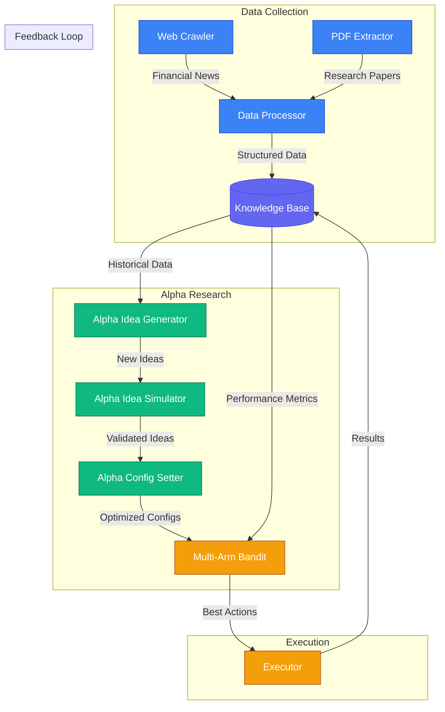
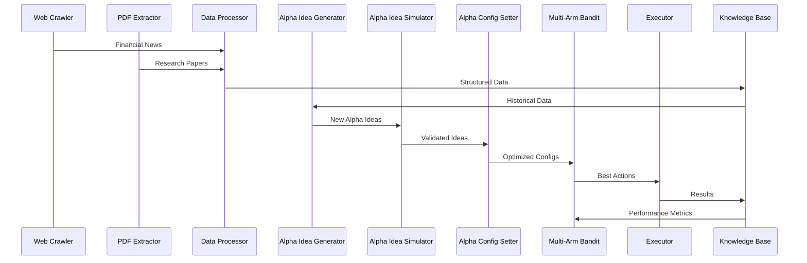

# WorldQuant Alpha Generator（世界量化的Alpha生成器）

本项目是一组用于生成并向WorldQuant平台提交Alpha因子的脚本集合。

## 🎯 **推荐方案：Naive-Ollama**

**为了获得最佳性能和用户体验，我们推荐使用[Naive-Ollama Alpha Generator](#naive-ollama-alpha-generator-推荐)，其具有以下特点：**

- 🚀 **生成速度快3-5倍**，使用本地Ollama大语言模型
- 🖥️ **GPU加速**，实现最佳性能
- 📊 **实时Web仪表板**，便于监控和控制
- 🤖 **全自动运行**，支持7×24小时操作
- 🔒 **本地处理**，无外部API费用和隐私担忧
- 🐳 **Docker支持**，便于部署
- 📈 **高级编排**，具备智能调度功能

**快速开始：**
```bash
cd naive-ollama
# 在credential.txt中设置凭证
docker-compose -f docker-compose.gpu.yml up -d
# 访问仪表板 http://localhost:5000
```

---

<!-- 美观的ASCII艺术 -->


```
 __      __            .__       .___                          __            .__                     
/  \    /  \___________|  |    __| _/________ _______    _____/  |_    _____ |__| ____   ___________ 
\   \/\/   /  _ \_  __ \  |   / __ |/ ____/  |  \__  \  /    \   __\  /     \|  |/    \_/ __ \_  __ \
 \        (  <_> )  | \/  |__/ /_/ < <_|  |  |  // __ \|   |  \  |   |  Y Y  \  |   |  \  ___/|  | \/
  \__/\  / \____/|__|  |____/\____ |\__   |____/(____  /___|  /__|   |__|_|  /__|___|  /\___  >__|   
       \/                         \/   |__|          \/     \/             \/        \/     \/       
```


Discord: https://discord.gg/3B2TmHQw

使用教程（制作中）网页版: https://www.youtube.com/watch?v=xwr9atsulSA
本地Ollama版本的进一步使用教程: https://www.youtube.com/watch?v=EAeujBRrKiI


# Rust Alpha Generator（Rust Alpha生成器）

这是Alpha生成器的Rust实现。

## 安装

```bash
cargo build --release
```

## 使用

```bash
cargo run --release
```

# Python Alpha Generator（Python Alpha生成器）

## 简介：Pre-Consultant和Consultant的区别

- Pre-Consultant最大支持5个并发模拟
- Pre-Consultant的操作符和数据字段选项较少

## Agent N8N

即将推出... lol

## Naive-Ollama Alpha Generator（推荐）

一个复杂的Alpha因子生成系统，使用Ollama和金融语言模型生成、测试并向WorldQuant Brain提交Alpha因子。该系统用本地Ollama解决方案替代了之前的Kimi接口，以获得更好的性能和控制。

### 🚀 主要特性

- **本地大语言模型集成**：使用Ollama及llama3.2:3b或llama2:7b模型
- **GPU加速**：完全支持NVIDIA GPU以实现更快的推理
- **Web仪表板**：实时监控和控制界面
- **自动化编排**：持续的Alpha生成、挖掘和提交
- **WorldQuant Brain集成**：直接API集成用于测试和提交
- **Docker支持**：使用Docker和Docker Compose轻松部署
- **每日速率限制**：确保遵守WorldQuant提交限制

### 🏗️ 架构

```
┌─────────────────┐    ┌─────────────────┐    ┌─────────────────┐
│   Web Dashboard │    │ Alpha Generator │    │  WorldQuant API │
│   (Flask)       │◄──►│   (Ollama)      │◄──►│   (External)    │
│   Port 5000     │    │   Port 11434    │    │                 │
└─────────────────┘    └─────────────────┘    └─────────────────┘
         │                       │                       │
         │              ┌─────────────────┐              │
         └──────────────►│ Alpha Orchestrator │◄─────────────┘
                        │   (Python)      │
                        └─────────────────┘
                                │
                                ▼
                        ┌─────────────────┐
                        │   Results &     │
                        │   Logs Storage  │
                        └─────────────────┘
```

### 🚀 快速开始

#### 1. 设置凭证

创建 `naive-ollama/credential.txt` 文件，填入您的WorldQuant Brain凭证：
```json
["your.email@worldquant.com", "your_password"]
```

#### 2. 使用GPU支持启动（推荐）

```bash
cd naive-ollama
# 使用GPU加速启动完整系统
docker-compose -f docker-compose.gpu.yml up -d

# 或使用便捷脚本
start_gpu.bat
```

#### 3. 访问Web仪表板

打开浏览器并导航到：
- **主仪表板**: http://localhost:5000
- **Ollama WebUI**: http://localhost:3000
- **Ollama API**: http://localhost:11434

### 📊 Web仪表板特性

Web仪表板提供实时监控和控制功能：

#### 状态监控
- **GPU状态**: 内存使用情况、利用率、温度
- **Ollama状态**: 模型加载、API连接性
- **Orchestrator状态**: 生成活动、挖掘计划
- **WorldQuant状态**: API连接性、身份验证
- **统计数据**: 生成的Alphas、成功率、24小时指标

#### 手动控制
- **生成Alpha**: 触发单个Alpha生成
- **触发挖掘**: 运行Alpha表达式挖掘
- **触发提交**: 提交成功的Alphas
- **刷新状态**: 更新所有指标

#### 实时日志
- **Alpha生成器日志**: 显示Alpha生成活动的过滤日志
- **系统日志**: 完整的系统活动
- **最近活动**: 最近事件的时间线

### 🔄 工作流程

#### 1. Alpha生成
- **连续模式**: 每6小时生成Alphas
- **批处理**: 每批生成3个Alphas
- **Ollama集成**: 使用本地大语言模型生成Alpha想法
- **WorldQuant测试**: 立即测试每个Alpha

#### 2. Alpha挖掘
- **表达式挖掘**: 分析有前景的Alphas以寻找变体
- **模式识别**: 识别成功的Alpha模式
- **优化**: 为现有Alphas提出改进建议

#### 3. Alpha提交
- **每日限制**: 每天仅提交一次
- **成功过滤**: 仅提交表现良好的Alphas
- **速率限制**: 遵守WorldQuant API限制

### 📈 性能提升

#### 生成速度
- **之前**: ~10-15秒每个Alpha（Kimi API）
- **之后**: ~3-5秒每个Alpha（本地Ollama + GPU）

#### 自动化
- **之前**: 需要手动干预
- **之后**: 完全自动化的7×24小时运行

### 📁 文件结构

```
naive-ollama/
├── alpha_generator_ollama.py      # 主Alpha生成脚本
├── alpha_orchestrator.py          # 编排和调度
├── alpha_expression_miner.py      # Alpha表达式挖掘
├── successful_alpha_submitter.py  # 向WorldQuant提交Alpha
├── web_dashboard.py               # Flask web仪表板
├── templates/
│   └── dashboard.html             # 仪表板HTML模板
├── results/                       # 生成的Alpha结果
├── logs/                          # 系统日志
├── Dockerfile                     # Docker镜像定义
├── docker-compose.gpu.yml         # 启用GPU的部署
├── docker-compose.yml             # 仅CPU的部署
├── requirements.txt               # Python依赖
├── credential.txt                 # WorldQuant凭证
├── start_gpu.bat                  # Windows GPU启动脚本
├── start_dashboard.bat            # Windows仪表板启动脚本
├── README.md                      # 详细文档
├── README_Docker.md               # Docker特定文档
└── CHANGELOG.md                   # 版本历史
```

### 🛠️ 技术栈

#### 后端
- **Python 3.8**: 主应用程序语言
- **Flask**: Web仪表板框架
- **Requests**: API的HTTP客户端
- **Schedule**: 任务调度
- **PyTorch**: GPU加速支持

#### 基础设施
- **Docker**: 容器化
- **Docker Compose**: 多服务编排
- **NVIDIA CUDA**: GPU加速
- **Ollama**: 本地大语言模型服务

#### 前端
- **HTML5/CSS3**: 仪表板界面
- **JavaScript**: 实时更新
- **响应式设计**: 移动友好的布局

### 🔒 安全

- **本地处理**: 所有大语言模型推理都在本地进行
- **凭证保护**: 凭证存储在挂载卷中
- **网络隔离**: Docker网络隔离
- **API速率限制**: 遵守外部API限制

### 📝 文档

有关详细文档，请参阅：
- [naive-ollama/README.md](naive-ollama/README.md) - 主项目文档
- [naive-ollama/README_Docker.md](naive-ollama/README_Docker.md) - Docker特定文档
- [naive-ollama/CHANGELOG.md](naive-ollama/CHANGELOG.md) - 版本历史

### 🚀 为什么选择Naive-Ollama？

1. **性能**: 比Kimi API快3-5倍
2. **成本**: 无外部API费用
3. **隐私**: 所有处理都在本地进行
4. **控制**: 对大语言模型和工作流程的完全控制
5. **自动化**: 7×24小时连续运行
6. **监控**: 实时Web仪表板
7. **可扩展性**: GPU加速支持
8. **可靠性**: Docker容器化

## Pre-Consultant（预顾问版）

这基本上是一个闭环系统，从alpha_generator.py开始，它使用Kimi AI生成Alpha想法。然后将有前景的Alpha转储到本地日志文件中，promising_alpha_miner.py将挖掘更好的结果，并将优化后的Alpha转储到本地日志文件中，您可以运行successful_alpha_submitter.py将它们提交到WorldQuant平台。这些脚本可以并发运行。

而alpha_expression_miner.py更像是一个实用脚本，用于从给定表达式中手动挖掘Alpha表达式，但不在上述闭环系统内。

alpha_101_testing正在开发中。

alpha_polisher.py正在开发中。

### 安装

```bash
pip install -r requirements.txt
```

### 使用

#### Alpha Generator（Alpha生成器）

预顾问版Python Alpha生成器使用Kimi AI生成Alpha表达式。请注意，只要您能承担费用，就可以获得一些Alpha想法。

人工控制是该脚本的未来发展方向。


```bash
python alpha_generator.py
```

#### Alpha Expression Miner（Alpha表达式挖掘器）

此脚本用于从给定表达式中挖掘Alpha表达式。

```bash
python alpha_expression_miner.py --expression "expression"


PS ~> python .\alpha_expression_miner.py --expression "cashflow_stability = ts_mean(cashflow_op, 252) / (debt_lt + 0.01);
>> stability_z = zscore(cashflow_stability);
>> debt_ratio = debt_lt / (assets + 0.01);
>> combined_score = stability_z - zscore(debt_ratio);
>> -rank(combined_score)"
2025-05-04 01:37:50,111 - INFO - Starting alpha expression mining with parameters:
2025-05-04 01:37:50,111 - INFO - Expression: cashflow_stability = ts_mean(cashflow_op, 252) / (debt_lt + 0.01);
stability_z = zscore(cashflow_stability);
debt_ratio = debt_lt / (assets + 0.01);
combined_score = stability_z - zscore(debt_ratio);
-rank(combined_score)
2025-05-04 01:37:50,111 - INFO - Output file: mined_expressions.json
2025-05-04 01:37:50,112 - INFO - Initializing AlphaExpressionMiner
2025-05-04 01:37:50,112 - INFO - Loading credentials from ./credential.txt
2025-05-04 01:37:50,112 - INFO - Authenticating with WorldQuant Brain...
2025-05-04 01:37:51,303 - INFO - Authentication response status: 201
2025-05-04 01:37:51,303 - INFO - Authentication successful
2025-05-04 01:37:51,303 - INFO - Parsing expression: cashflow_stability = ts_mean(cashflow_op, 252) / (debt_lt + 0.01);
stability_z = zscore(cashflow_stability);
debt_ratio = debt_lt / (assets + 0.01);
combined_score = stability_z - zscore(debt_ratio);
-rank(combined_score)
2025-05-04 01:37:51,303 - INFO - Found 3 parameters to vary

Found the following parameters in the expression:
1. Value: 252.0 | Context: ...s_mean(cashflow_op, 252) / (debt_lt + 0.01)...
2. Value: 0.01 | Context: ..., 252) / (debt_lt + 0.01);
stability_z = zsc...
3. Value: 0.01 | Context: ...debt_lt / (assets + 0.01);
combined_score = ...

Enter the numbers of parameters to vary (comma-separated, or 'all'): all

Parameter: 252.0 | Context: ...s_mean(cashflow_op, 252) / (debt_lt + 0.01)...
Enter range (e.g., '10' for ±10, or '5,15' for 5 to 15): 25
Enter step size: 1

Parameter: 0.01 | Context: ..., 252) / (debt_lt + 0.01);
stability_z = zsc...
Enter range (e.g., '10' for ±10, or '5,15' for 5 to 15): -0.05,0.05
Enter step size: 0.01

Parameter: 0.01 | Context: ...debt_lt / (assets + 0.01);
combined_score = ...
Enter range (e.g., '10' for ±10, or '5,15' for 5 to 15): -0.05,0.05
Enter step size: 0.01
2025-05-04 01:38:18,371 - INFO - Generating variations based on selected parameters
2025-05-04 01:38:18,375 - INFO - Generated 5100 total variations
2025-05-04 01:38:18,376 - INFO - Testing variation 1/5100: cashflow_stability = ts_mean(cashflow_op, 227) / (debt_lt + -0.05);
stability_z = zscore(cashflow_stability);
debt_ratio = debt_lt / (assets + -0.05);
combined_score = stability_z - zscore(debt_ratio);
-rank(combined_score)
2025-05-04 01:38:18,376 - INFO - Testing alpha: cashflow_stability = ts_mean(cashflow_op, 227) / (debt_lt + -0.05);
stability_z = zscore(cashflow_stability);
debt_ratio = debt_lt / (assets + -0.05);
combined_score = stability_z - zscore(debt_ratio);
-rank(combined_score)
2025-05-04 01:38:18,754 - INFO - Simulation creation response: 201

```

#### Clean Up Logs（清理日志）

此脚本用于清理日志。

```bash
python clean_up_logs.py
```

#### Successful Alpha Submitter（成功Alpha提交器）

此脚本用于向WorldQuant平台提交成功的Alphas。目前不建议使用此脚本，因为它会一次性提交所有Alphas，而不是每天提交一次。

```bash
python successful_alpha_submitter.py
```

## Pre-Consultant Non-AI（预顾问版非AI）
[machine_lib.py](file:///d:/projectcode/pythonwork/worldquant-miner/python/pre_consultant_non_ai/machine_lib.py) 模块通过WorldQuant平台提供Alpha生成和测试的核心功能。以下是主要组件：

### WorldQuantBrain 类
处理与WorldQuant API交互和Alpha生成逻辑的主类：

- WorldQuant平台的身份验证和会话管理
- 获取和处理数据字段（矩阵和向量类型）
- 使用操作符和数据字段生成Alpha表达式
- 运行模拟以测试Alpha性能
- 处理和分析模拟结果

### 主要特性
- 自动化Alpha生成，使用以下组合：
  - 数据字段（矩阵和向量类型）
  - 数学操作符（+、-、*、/等）
  - 排名和评分函数
  - 时间序列操作
- 模拟能力：
  - 单个Alpha测试
  - 批量模拟支持
  - 性能指标计算
- 结果处理：
  - 基于性能阈值进行过滤
  - 存储成功的Alphas
  - 错误处理和日志记录

### 数据处理
- 数据字段分类（矩阵与向量）
- 表达式验证
- 性能指标计算：
  - 信息比率（IR）
  - 收益
  - 换手率
  - 相关性分析

该库作为自动化Alpha挖掘和测试的基础，提供了与WorldQuant平台程序化交互所需的工具。

```bash
python machine_miner.py --username your_worldquant_username --password your_worldquant_password
```


## Consultant（顾问版）

就像预顾问版非AI一样，但没有像单次模拟和跳过无法访问的数据字段和操作符这样的变通方法。


### 安装

```bash
pip install -r requirements.txt
```

### 使用

```bash
python machine_miner.py --username your_worldquant_username --password your_worldquant_password
```

# 项目演进

## 🚀 **最新：Naive-Ollama (v2.0)**
- **本地大语言模型集成**：Ollama及llama3.2:3b/llama2:7b模型
- **GPU加速**：NVIDIA CUDA支持更快的推理
- **Web仪表板**：实时监控和控制界面
- **自动化编排**：持续的Alpha生成、挖掘和提交
- **Docker支持**：通过容器化轻松部署
- **性能**：比之前的方法快3-5倍

## 📈 **早期版本**
- **v1.0**：基本的Kimi API集成和手动工作流程
- **v1.1**：Alpha表达式挖掘和优化
- **v1.2**：带速率限制的自动提交
- **v2.0**：使用Ollama、GPU支持和Web仪表板的完整重写

# TODO
- 集成更多模板
- 集成更多数据字段
- 集成更多操作符
- 集成更多地区
- 集成更多宇宙
- 集成更多Alphas

# 即将推出的功能
## GUI
### 简介
- 使用Python GUI管理WorldQuant Alpha Generator的临时解决方案
### 预览

## Agent
### 预览

### 简介
- 使用Python GUI管理代理网络的临时解决方案
## Agent site - agent-next
### 简介
- 关键点
  - 一个免费（目前因为还没完成哈哈）的用户友好界面，用于创建与WorldQuant Alpha Generator配合使用的代理网络
  - 开源且仅前端数据库交互，因此您可以看到网站不会保存您的WorldQuant凭证，但您的邮箱将用于识别您
    - 您需要首先通过API验证WorldQuant，然后验证网站
    - 服务器端不会保存WorldQuant凭证，但您的邮箱将用于识别您
  - 管理代理网络需要登录
  - 提供免费层
  - 利用向量数据库存储代理记忆
- 特性
  - 与代理聊天
  - 创建代理网络
  - 管理代理网络
  - 删除代理网络
  - 查看代理网络
  - 查看代理记忆
  - Alpha Polisher - 使用AI优化现有Alphas或生成新想法

### 预览


## A2A协议实现
### 简介
- 关键点
  - 实现代理到代理（A2A）协议用于自动化金融研究
  - 模拟真实世界金融分析师工作流程的规定性代理架构
  - 与现有的WorldQuant Alpha Generator组件集成
  - 具有专门代理的自动化Alpha挖掘管道

### 架构


- **数据收集代理**
  - 网络爬虫代理：自动化金融新闻和市场数据收集
  - PDF提取代理：研究报告处理和信息提取
  - 数据处理代理：数据转换和知识库管理

- **Alpha研究代理**
  - Alpha想法生成代理：模式识别和想法生成
  - Alpha想法模拟代理：Alpha想法的验证和测试
  - Alpha配置设置代理：参数优化和配置

- **执行代理**
  - 多臂老虎机代理：用于动作选择的强化学习
  - 执行代理：所选动作的实施和监控

### 通信流程


### 特性
- 自动化研究工作流程编排
- 代理间的结构化数据交换
- 性能反馈循环
- 知识库集成
- 实时进度跟踪
- 基于优先级的任务调度

### 与现有组件的集成
- 与代理记忆的向量数据库集成
- 与WorldQuant平台的API集成
- 用于监控和控制的Web界面
- 自动化Alpha提交管道

### 未来增强功能
- 用于研究论文分析的高级自然语言处理
- 用于模式识别的机器学习模型
- 自动化假设生成和测试
- 实时市场数据集成
- 性能优化和扩展
- 增强的错误处理和恢复机制

# 贡献
## 如何贡献

我们欢迎社区的贡献！以下是您可以提供帮助的方式：

### 代码贡献

1. Fork仓库
2. 创建新分支（`git checkout -b feature/improvement`）
3. 进行更改
4. 运行测试以确保没有破坏任何功能
5. 提交更改（`git commit -am 'Add new feature'`）
6. 推送到分支（`git push origin feature/improvement`）
7. 创建Pull Request

### 错误报告和功能请求

- 使用GitHub问题跟踪器报告错误
- 清楚地描述问题，包括重现步骤
- 通过GitHub问题提出功能请求
- 适当地标记问题

### 文档

- 帮助改进文档
- 在需要的地方添加代码注释
- 用新功能更新README
- 编写教程和示例

### 指南

- 遵循现有的代码风格和约定
- 编写清晰的提交消息
- 为新功能添加测试
- 为更改更新文档
- 对其他贡献者保持尊重

### 获取帮助

- 加入我们的社区聊天
- 在GitHub问题中提问
- 阅读现有文档
- 查看已关闭的问题以寻找解决方案

我们感谢所有有助于让这个项目变得更好的贡献！

# Dify组件集成

本项目集成了来自Dify（agent-dify-api和agent-dify-web）的组件，以增强Alpha挖掘能力。这些组件在Apache License 2.0下使用。

## 法律声明

Dify组件（agent-dify-api和agent-dify-web）在Apache License 2.0下授权。这意味着：

1. 您可以使用、复制和分发Dify组件
2. 您可以修改和创建衍生作品
3. 您必须包含原始版权声明
4. 您必须说明对原始软件所做的重大更改
5. 您必须包含Apache License 2.0的副本

有关完整条款和条件，请参阅[Apache License 2.0](https://www.apache.org/licenses/LICENSE-2.0)。

## Dify组件的使用

Dify组件集成到本项目中以增强Alpha挖掘能力：

1. **agent-dify-api**：提供Alpha生成和挖掘的API端点
2. **agent-dify-web**：提供Alpha挖掘操作的Web界面

### 与Alpha挖掘的集成

Dify组件用于：
- 生成和验证Alpha表达式
- 处理和分析市场数据
- 提供用户友好的Alpha挖掘界面
- 启用自动化的Alpha生成和提交

### 归属

本项目使用在Apache License 2.0下授权的Dify组件。原始版权声明和许可信息保存在相应组件目录中。

## 许可证

本项目在Apache License 2.0下授权 - 有关详细信息，请参阅[LICENSE](LICENSE)文件。

## 教程：使用Dify组件进行Alpha挖掘

### 先决条件
1. 安装了Docker和Docker Compose
2. Python 3.8或更高版本
3. Node.js 16或更高版本（用于Web界面）

### 设置Dify组件

1. **启动Dify服务**
```bash
# 启动Dify API和Web服务
docker-compose -f docker-compose.middleware.yaml up -d
```

2. **验证服务**
```bash
# 检查服务是否正在运行
docker ps
```

### 使用Dify Web界面

1. **访问Web界面**
   - 打开浏览器并导航到`http://localhost:3000`
   - 使用您的凭证登录

2. **创建Alpha挖掘任务**
   - 在Web界面中点击"New Task"
   - 选择"Alpha Mining"作为任务类型
   - 配置您的挖掘参数：
     - 要使用的数据字段
     - 时间周期
     - 宇宙选择
     - 挖掘策略

3. **监控挖掘进度**
   - 在仪表板中查看实时挖掘进度
   - 在"Results"部分检查生成的Alphas
   - 导出成功的Alphas以供提交

### 使用Dify API

1. **API身份验证**
```python
import requests

API_URL = "http://localhost:8000"
headers = {
    "Authorization": "Bearer your_api_key"
}
```

2. **创建挖掘任务**
```python
# 创建新的挖掘任务
response = requests.post(
    f"{API_URL}/api/v1/mining/tasks",
    headers=headers,
    json={
        "name": "My Mining Task",
        "data_fields": ["close", "volume", "high", "low"],
        "time_period": "1Y",
        "universe": "US",
        "strategy": "correlation"
    }
)
```

3. **检查任务状态**
```python
# 获取任务状态
task_id = response.json()["task_id"]
status = requests.get(
    f"{API_URL}/api/v1/mining/tasks/{task_id}",
    headers=headers
)
```

4. **获取结果**
```python
# 获取挖掘结果
results = requests.get(
    f"{API_URL}/api/v1/mining/tasks/{task_id}/results",
    headers=headers
)
```

### 最佳实践

1. **资源管理**
   - 在挖掘过程中监控系统资源
   - 根据可用资源调整挖掘参数
   - 为长时间运行的任务使用适当的超时

2. **错误处理**
   - 在API调用中实现适当的错误处理
   - 定期检查任务状态
   - 保存中间结果

3. **性能优化**
   - 使用适当的批处理大小
   - 在可能的地方实现缓存
   - 监控和调整挖掘参数

### 故障排除

1. **服务问题**
   - 检查Docker容器日志：`docker logs <container_id>`
   - 验证服务健康状况：`docker-compose ps`
   - 如有必要重启服务：`docker-compose restart`

2. **API问题**
   - 验证API端点可用性
   - 检查身份验证令牌
   - 监控API速率限制

3. **挖掘问题**
   - 验证数据字段可用性
   - 检查宇宙配置
   - 监控内存使用情况

有关特定功能和配置的更多详细信息，请参阅[Dify文档](https://docs.dify.ai)。